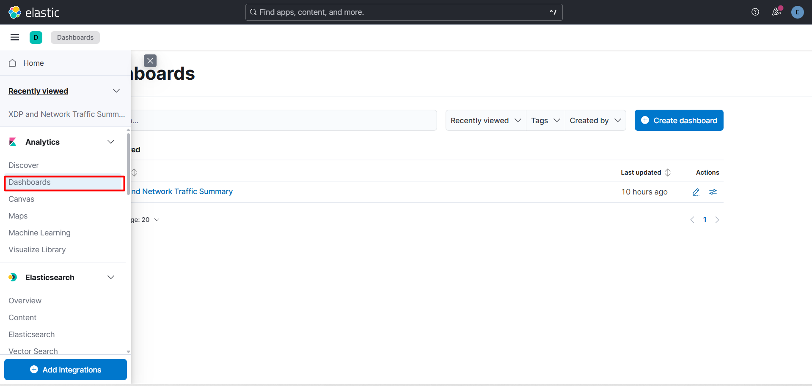
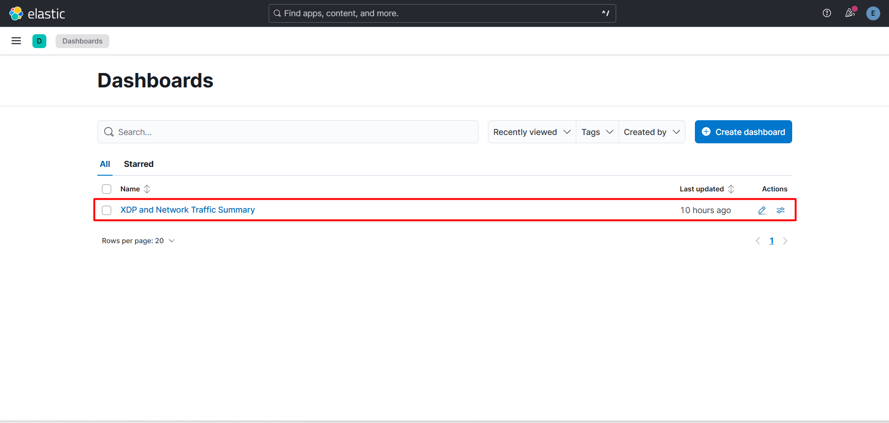
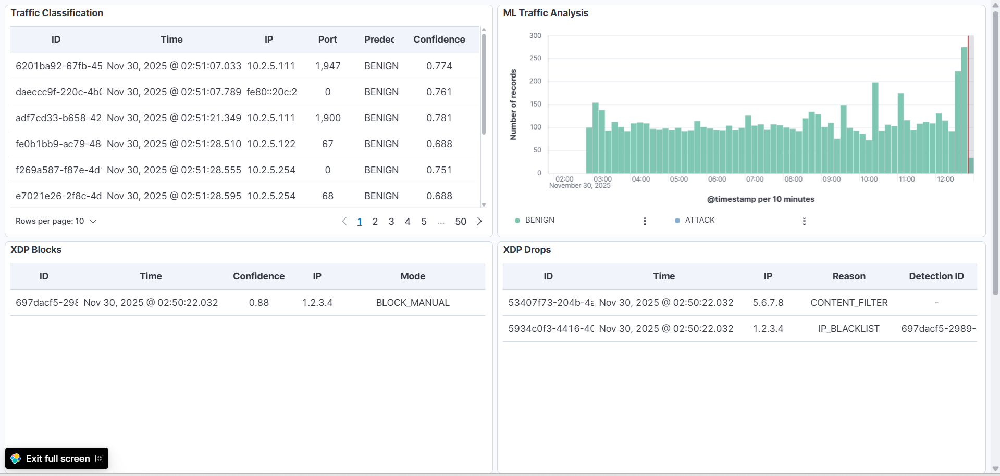
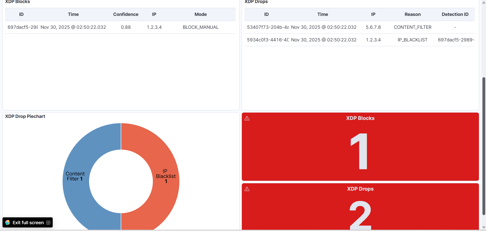
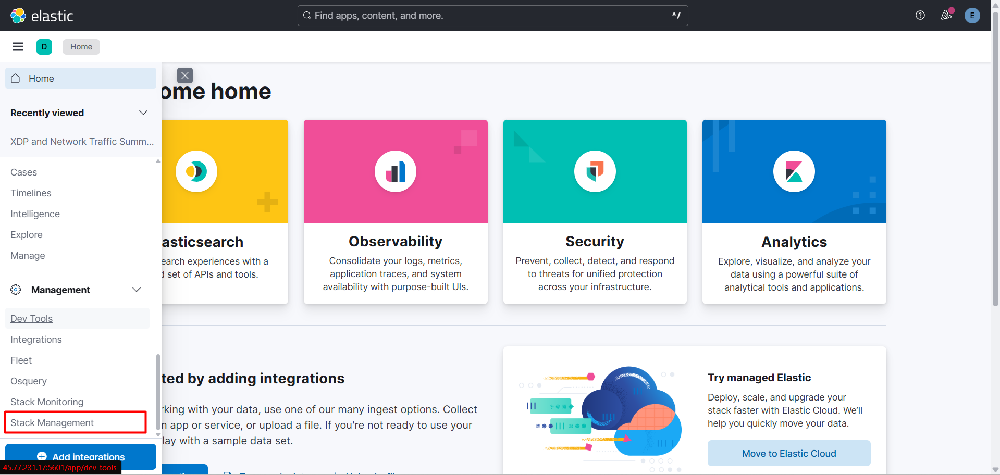
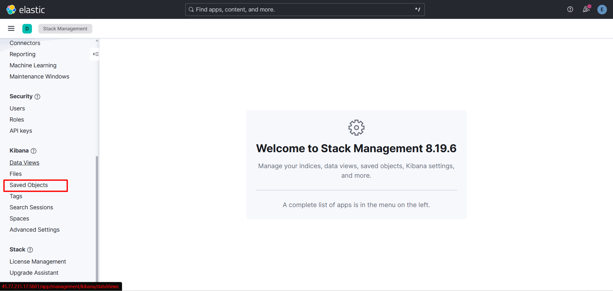
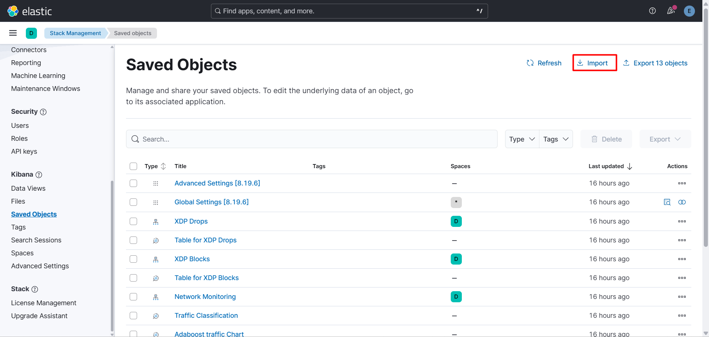

# XDP-Based Real-Time DDoS Defense System

This system provides real-time detection and mitigation of DDoS attacks using flow-based machine learning and kernel-level packet enforcement.

It consists of:

- **NFStream**: Real-time feature extraction from network traffic.
- **AdaBoost ML Model**: Classifies traffic as BENIGN or ATTACK.
- **Redis**: Messaging broker for attack signaling.
- **XDP/eBPF**: Kernel-level enforcement for high-speed packet dropping.
- **Elasticsearch & Kibana**: Centralized logging and visualization.

All components run inside Docker containers orchestrated with Docker Compose.

---

## Hardware Requirements

Recommended minimum specifications for deployment:

| Resource | Minimum | Recommended | Notes |
|----------|---------|-------------|-------|
| **CPU** | 2 Cores | 4+ Cores | ML inference requires dedicated CPU cycles. |
| **RAM** | 4 GB | 8 GB+ | Elasticsearch is memory intensive. |
| **Storage** | 20 GB | 40 GB | For Docker images and log data. |
| **Network** | XDP-capable NIC | Dedicated NIC | Bridged Mode required for VMs. |
| **OS** | Linux (x86_64) | Linux (x86_64) | Ubuntu 22.04 LTS verified. |

**Virtual Machine Users**: If running on VMware, VirtualBox, or KVM, you must use **Bridged Network Mode**. NAT mode hides source IPs which can lead to some issues. 

---

## Software Requirements

Ensure the following are installed on your host machine before starting:

### 1. Operating System & Kernel

- **Verified on**: Ubuntu 22.04.05 LTS (Kernel 5.15.0-161-generic)
- **Minimum Kernel**: 5.4+ (Required for BPF CO-RE support)
- **Privileges**: Root or sudo access is required to load XDP programs

To check your kernel version:

```bash
uname -r
```

### 2. Docker Environment

- **Docker Engine**: v20.10+
- **Docker Compose**: v2.0+

To verify your local Docker installation:

```bash
docker --version
docker compose version
```

### 3. Kernel Tools (CRITICAL)

The system mounts the host's BPF tools into the container. You must install the tools specific to your running kernel to avoid "bpftool not found" errors.

```bash
# Ubuntu/Debian
sudo apt-get update
sudo apt-get install linux-tools-$(uname -r) linux-tools-common linux-tools-generic
```

---

## Quick Start Guide

### 1. Download the Project

**Option A: Git Clone (Recommended)**

```bash
git clone https://github.com/rexsez/ddos-defense.git
cd ddos-defense
```

**Option B: ZIP Download**

Download and extract the ZIP file from https://github.com/rexsez/ddos-defense, then navigate to the directory:

```bash
unzip ddos-defense-main.zip
cd ddos-defense-main
```

### 2. Start the System

Make the scripts executable and run the startup script. This script handles dependency detection, permission fixing, and container orchestration automatically.

```bash
chmod +x *.sh
sudo ./start.sh
```

### 3. Monitor Startup

You can follow the logs to ensure all services start correctly:

```bash
docker logs -f ddos-app
```

(Press `Ctrl+C` to stop following logs)

**Expected Output**:

```
Detecting network interface...
Using interface: ens33

...
SUCCESS: Kibana is ready
Dashboards imported successfully
Demo data inserted successfully

xdp-controller entered RUNNING state
ml-pipeline entered RUNNING state
```

## Service Verification

Once the system is running, verify the status of the components.

### Service Roles

- **XDP Controller**: Handles kernel-level enforcement and IP blocking.
- **ML Pipeline**: Runs NFStream capture + AdaBoost classification.

Both services must be in the **RUNNING** state for the defense to work.

### Service Info & Credentials

| Service | URL | Credentials |
|---------|-----|-------------|
| **Kibana** | http://localhost:5601 | User: `elastic` / Pass: `jgYsL5-kztDUSd8HyiNd` |
| **Elasticsearch** | http://localhost:9200 | User: `elastic` / Pass: `jgYsL5-kztDUSd8HyiNd` |
| **Redis** | localhost:6379 | N/A |

---

## Accessing the Dashboard

1. Open http://localhost:5601 in your browser.
2. Log in with the credentials provided above.
3. Open the hamburger menu (≡) in the top-left corner.
4. Navigate to **Analytics** → **Dashboards**.
5. Select **"XDP and Network Traffic Summary"**.









The dashboard displays real-time metrics including:

- Traffic flow statistics
- Dropped packet counters
- ML classification results
- Active blocks

---

## Validation & Testing

### 1. Manual IP Blocking

You can validate the blocking capability using the management script.

```bash
# Block an IP
sudo ./manage_blacklist.sh block-ip 192.168.1.100

# List all blocked IPs
sudo ./manage_blacklist.sh list

# Unblock an IP
sudo ./manage_blacklist.sh remove-ip 192.168.1.100
```

**Expected Result**: Packets from the blocked IP should be dropped immediately, and the "XDP Blocks" counter in Kibana should increase.

### 2. Content-Based Filtering

The kernel is hardcoded to drop packets containing the string **"Test Data"**.

**On the protected system (Host)**:

```bash
sudo nc -lvnp 8080
```

**From an attacker machine**:

```bash
nc <target-ip> 8080
Test Data
```

**Expected Result**:

- The connection should hang or timeout (packet dropped).
- Logs should show: `[xdp-ctrl][WARN] DROP DETECTED: <IP> (CONTENT_FILTER)`

---

## Troubleshooting

### Dashboard Import Failed

If dashboards are missing in Kibana, you can import them manually:

1. Go to **Stack Management** → **Saved Objects**.
2. Click **Import**.
3. Select the file: `config/kibana/dashboards/kibana_dashboards.ndjson`.







### Containers Fail to Start

- **Elasticsearch Exits**: Check memory usage. Ensure `vm.max_map_count` is set correctly (the start script attempts to do this).
- **Permission Errors**: Run `sudo ./start.sh clean` to reset permissions on the data directories.

### XDP Error: "bpftool not found"

This indicates the container cannot find the kernel tools on the host.

- **Verify installation**: `apt install linux-tools-$(uname -r)`
- **Re-run detection**: `sudo ./detect_xdp_deps.sh`

### XDP Error: "Device Busy" or "Failed to Pin"

If the system wasn't stopped cleanly, XDP maps may remain locked.

**Fix**: Run a clean restart to force-detach and remove stale maps.

```bash
sudo ./start.sh clean
```

---

## Stopping the System

To stop containers and keep data:

```bash
sudo ./start.sh down
```

To stop and delete all data (clean reset):

```bash
sudo ./start.sh clean
```
